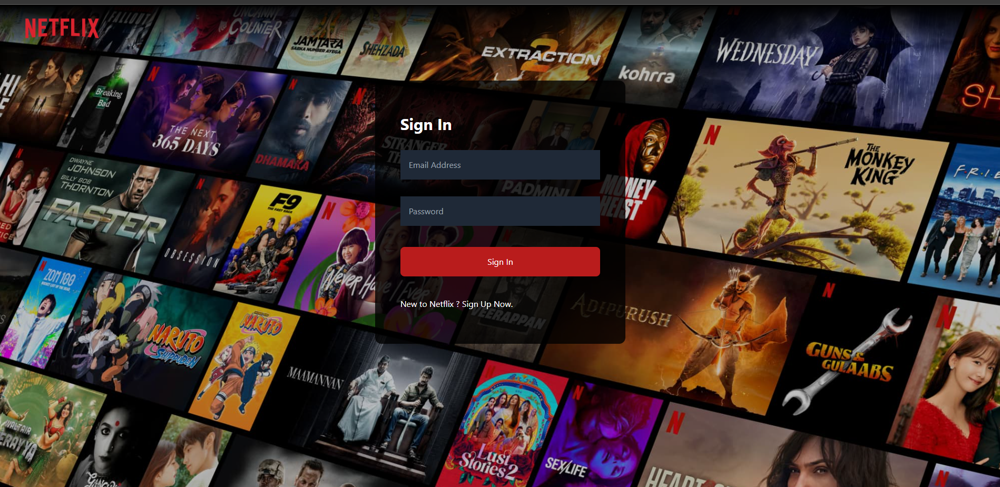

#Netflix GPT

- Create React App
- Configured TailwindCSS
- Header
- Login form
- Sign up form
- Form Validation
- UseRef hook
- firebase SetUp
- Deploying to firebase
- Create Signup User Account
- Implement Sign In user Api
- Craeted Redux Store with userSlice
- Implemented Sign out
- Update Profile
- BugFix:Sign up user displayName and profile picture update
- BugFix : If the user is logged in redirect to browse/ if not then redirect to login
- unsubscribe to the onAuthStateChanged callback on unmounting in header
- ADD hardcoded values in constants file
- Registered TMDB API & get access token
- Get Data from TMDB now playing movies list API
- Custom Hook for Now Playing Movies
- Update Store with movies Data
- Planning for MainContainer & secondary Container
- Fetch Data for Trailer Video
- Update Store with Trailer Video Data
- Embedded the Youtube video and make it autoplay and mute
- Tailwind Classes to make Main Container look awesome
- Build Secondary Component
- Build Movie List
- Built Movie Card
- Made Browse page amazing with Tailwind CSS
- usePopularMovies Custom Hooks

#Features

- Login/Sign Up
  - Sign In/Sign Up form
  - redirect to browse Page
- Browse(after authentication)

  - Header
  - Main Movie
    - Trailer in Background
    - Title & Description
    - MovieSuggestion
      - MovieLists \* N

- NetflixGPT

  - Search Bar
  - Movie Suggestion

  
